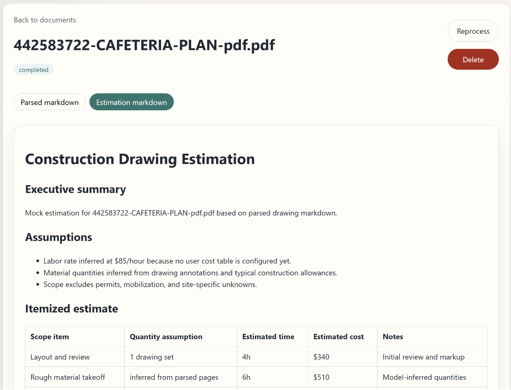

# Construction Drawing Estimation Service

Upload construction drawing PDFs, parse them into page-aware markdown, and generate time and cost estimations with live processing updates.

This app was created with **layered-spec**. The creation process is preserved for review:

- Screenshot: [`assets/screenshot.png`](../assets/screenshot.png)
- Chat log: [`chats/`](../chats/)
- Spec: [`specs/construction-drawing-pdf-estimation-service.md`](../specs/construction-drawing-pdf-estimation-service.md)



## Setup

```bash
cd service
cp .env.example .env
yarn install
yarn run db:push
yarn run dev
```

Configure Google OAuth credentials in `.env`:

- `GOOGLE_CLIENT_ID`
- `GOOGLE_CLIENT_SECRET`
- `GOOGLE_REDIRECT_URI`

Set `LLM_MOCK=true` for local development without an OpenAI API key.

## Scripts

- `yarn run dev` - start Next.js on port 3000 and WebSocket updates on port 3001
- `yarn test` - run Vitest integration tests
- `yarn run db:push` - apply Prisma schema to SQLite

## API

- `GET /api/auth/google/start`
- `GET /api/auth/google/callback`
- `GET /api/session`
- `POST /api/logout`
- `GET /api/documents`
- `POST /api/documents`
- `GET /api/documents/{documentId}`
- `DELETE /api/documents/{documentId}`
- `POST /api/documents/{documentId}/reprocess`
- `GET /api/updates/ws`
